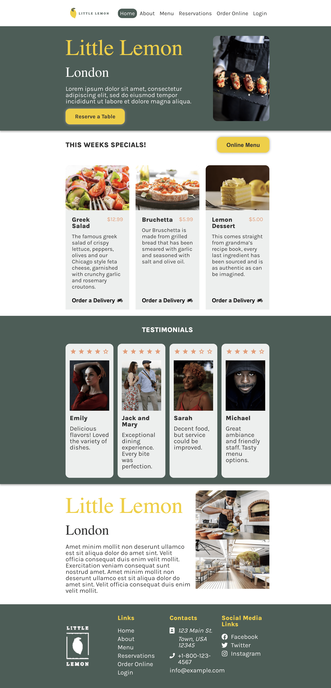
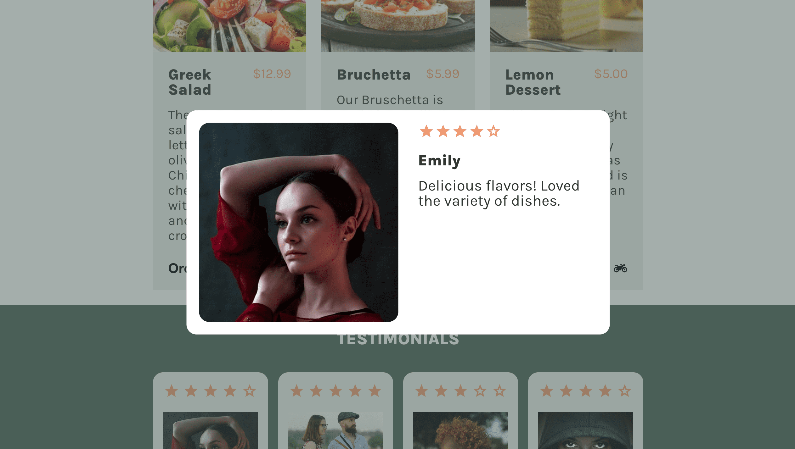
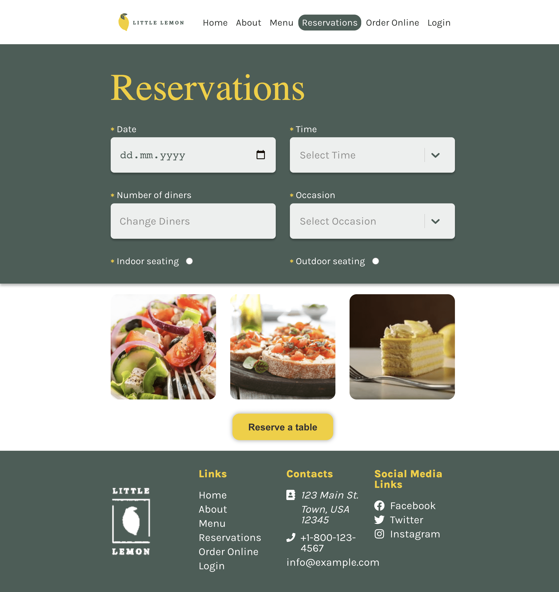
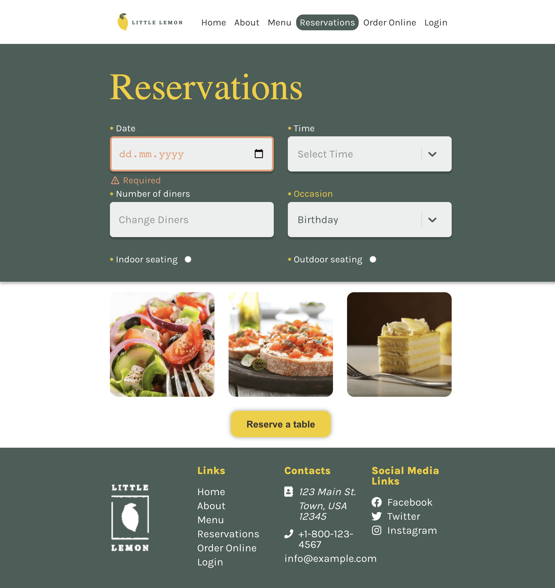
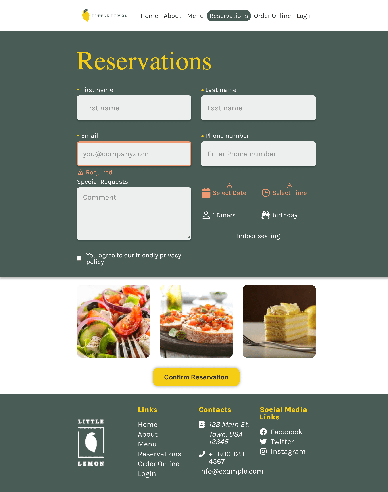
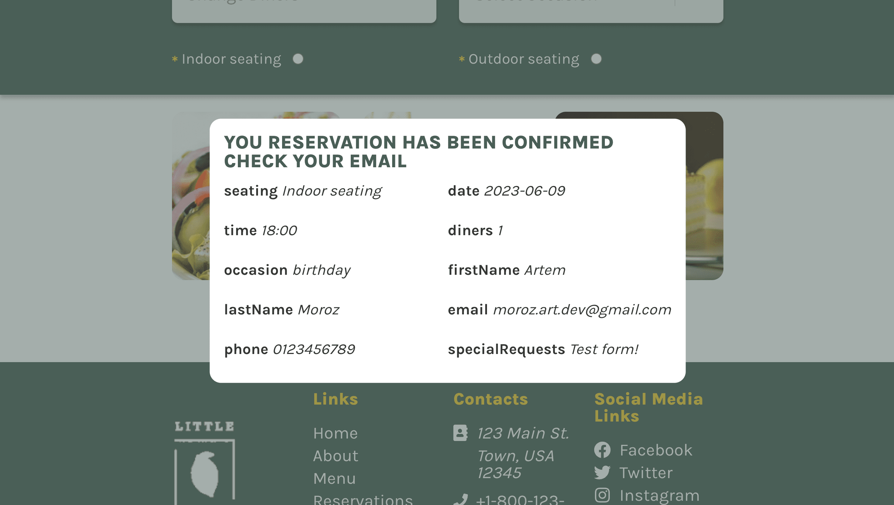

# Little Lemon Capstone

This project is a part of the "Meta Front-End Developer" specialization in the "Front-End Developer Capstone" course.
Little Lemon is a React app designed to [provide a brief description of what the project does or its purpose].

## Demo

Check out the live demo of the project: Little Lemon Demo [Little Lemon Capstone Demo](https://moroz-art-dev.github.io/little-lemon/)

## Libraries and Technologies Used

- [React](https://reactjs.org/)
- [React Router](https://reactrouter.com/)
- [React Router DOM](https://reactrouter.com/web/guides/quick-start)
- [Formik](https://formik.org/)
- [Prop Types](https://www.npmjs.com/package/prop-types)
- [React Icons](https://react-icons.github.io/react-icons/)
- [React Modal](https://www.npmjs.com/package/react-modal)
- [React Scroll](https://www.npmjs.com/package/react-scroll)
- [React Select](https://react-select.com/home)
- [React Transition Group](http://reactcommunity.org/react-transition-group/)
- [Yup](https://www.npmjs.com/package/yup)

## Dev Dependencies

The following dev dependencies were used in the development of this project:

- [Prettier](https://www.npmjs.com/package/prettier): Code formatter for maintaining consistent code style.
- [Stylelint](https://www.npmjs.com/package/stylelint): Linter for enforcing consistent CSS styles.
- [ESLint](https://www.npmjs.com/package/eslint): JavaScript linter for identifying and reporting code errors and enforcing coding styles.

## Getting Started

To get started with Little Lemon, follow these steps:

Clone the repository: `git clone https://github.com/moroz-art-dev/little-lemon.git`

Navigate to the project directory: `cd little-lemon`

Install the dependencies: `npm install`

Start the development server: `npm start`

The app will run in the development mode at `http://localhost:3000`.

Open this URL in your browser to view the app.

The page will automatically reload if you make any changes to the code, and you will also see any lint errors in the console.

## Screenshots

## Contribution

Contributions to Little Lemon are welcome.
If you encounter any issues or have suggestions for improvement, please create a new issue.

## License

This project is licensed under the MIT License.
